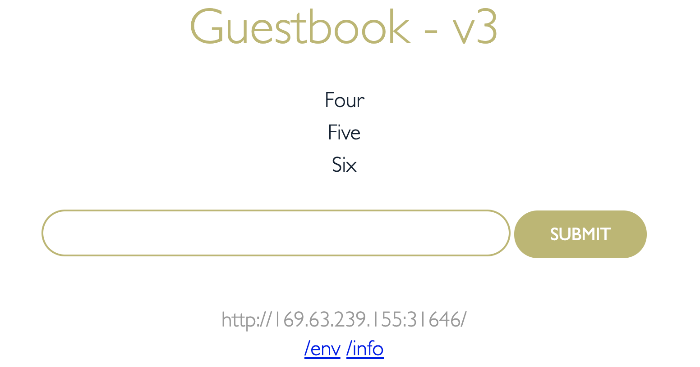

# Lab 1: File storage with kubernetes


PV Yaml:
```
apiVersion: v1
kind: PersistentVolume
metadata:
  name: guestbook-local-pv
  labels:
    type: local
spec:
  storageClassName: manual
  capacity:
    storage: 10Gi
  accessModes:
    - ReadWriteMany
  hostPath:
    path: "/mnt/data"
```

Create PV:
```
kubectl create -f guestbook-local-pv.yaml
persistentvolume/guestbook-local-pv created
❯ kubectl get pv
NAME                                       CAPACITY   ACCESS MODES   RECLAIM POLICY   STATUS      CLAIM                   STORAGECLASS       REASON   AGE
guestbook-local-pv                         10Gi       RWX            Retain           Available                           manual                      4s
```

PVC yaml:
```
apiVersion: v1
kind: PersistentVolumeClaim
metadata:
 name: guestbook-local-pvc
spec:
  storageClassName: manual
  accessModes:
    - ReadWriteMany
  resources:
    requests:
      storage: 3Gi
```

Create PVC:

```
kubectl create -f guestbook-local-pvc.yaml
persistentvolumeclaim/guestbook-local-pvc created
❯ kubectl get pvc
NAME                  STATUS   VOLUME                                     CAPACITY   ACCESS MODES   STORAGECLASS       AGE
guestbook-local-pvc   Bound    guestbook-local-pv                         10Gi       RWX            manual             6s
```


Build the image
Misc: (building v3 image)
```
docker build -t rojanjose/guestbook:v31 .
docker push rojanjose/guestbook:v31
https://hub.docker.com/repository/docker/rojanjose/guestbook/tags?page=1
```


Main.go file:
Line 186
```
//Setip data file
	f, err := os.OpenFile("data/datafile.txt", os.O_RDWR | os.O_CREATE | os.O_APPEND, 0666)
	
```

Deployment yaml:
```
apiVersion: apps/v1
kind: Deployment
...
    spec:
      containers:
        - name: guestbook
          image: rojanjose/guestbook:v31
          ports:
          - name: http-server
            containerPort: 3000
          volumeMounts:
          - name: guestbook-data-volume
            mountPath: /app/data
      volumes:
      - name: guestbook-data-volume
        persistentVolumeClaim:
          claimName: guestbook-local-pvc
```

Deploy Guestbook application:

```
❯ kubectl create -f guestbook-deployment.yaml
deployment.apps/guestbook-v1 created
❯ kubectl get pods
NAME                            READY   STATUS    RESTARTS   AGE
guestbook-v1-6f55cb54c5-jb89d   1/1     Running   0          14s
❯ kubectl create -f guestbook-service.yaml
service/guestbook created
```

Load data:


Log into the pod:

```
kubectl exec -it guestbook-v1-6f55cb54c5-jb89d --  busybox sh


BusyBox v1.21.1 (Ubuntu 1:1.21.0-1ubuntu1) built-in shell (ash)
Enter 'help' for a list of built-in commands.

/app # cat data/datafile.txt
2020/11/04 05:14:29 Logging guestbook data:
2020/11/04 05:20:14 One
2020/11/04 05:20:17 Two
2020/11/04 05:20:20 Three

/app # df -ah
Filesystem                Size      Used Available Use% Mounted on
overlay                  97.9G      1.4G     91.5G   2% /
proc                         0         0         0   0% /proc
tmpfs                    64.0M         0     64.0M   0% /dev
devpts                       0         0         0   0% /dev/pts
cgroup                       0         0         0   0% /sys/fs/cgroup/perf_event
...

/dev/xvda2               24.2G      2.2G     20.8G   9% /app/data
...
tmpfs                     7.8G         0      7.8G   0% /sys/firmware
```

Kill the pod:

```
kubectl get pods
NAME                            READY   STATUS    RESTARTS   AGE
guestbook-v1-6f55cb54c5-jb89d   1/1     Running   0          12m
❯
❯
❯ kubectl delete pod guestbook-v1-6f55cb54c5-jb89d
pod "guestbook-v1-6f55cb54c5-jb89d" deleted
❯ kubectl get pods
NAME                            READY   STATUS    RESTARTS   AGE
guestbook-v1-6f55cb54c5-gctwt   1/1     Running   0          11s
```


Enter data:



```
kubectl exec -it guestbook-v1-6f55cb54c5-gctwt --  busybox sh


BusyBox v1.21.1 (Ubuntu 1:1.21.0-1ubuntu1) built-in shell (ash)
Enter 'help' for a list of built-in commands.

/app # ls -alt
total 8972
drwxr-xr-x    1 root     root          4096 Nov  4 05:27 .
drwxr-xr-x    1 root     root          4096 Nov  4 05:27 ..
drwxr-xr-x    2 root     root          4096 Nov  4 05:14 data
drwxr-xr-x    1 root     root          4096 Nov  4 05:12 public
-rwxr-xr-x    1 root     root       9167339 Nov  4 05:12 guestbook
/app # cat data/datafile.txt
2020/11/04 05:14:29 Logging guestbook data:
2020/11/04 05:20:14 One
2020/11/04 05:20:17 Two
2020/11/04 05:20:20 Three
2020/11/04 05:27:20 Logging guestbook data:
2020/11/04 05:32:04 Four
2020/11/04 05:32:07 Five
2020/11/04 05:32:08 Six
```

