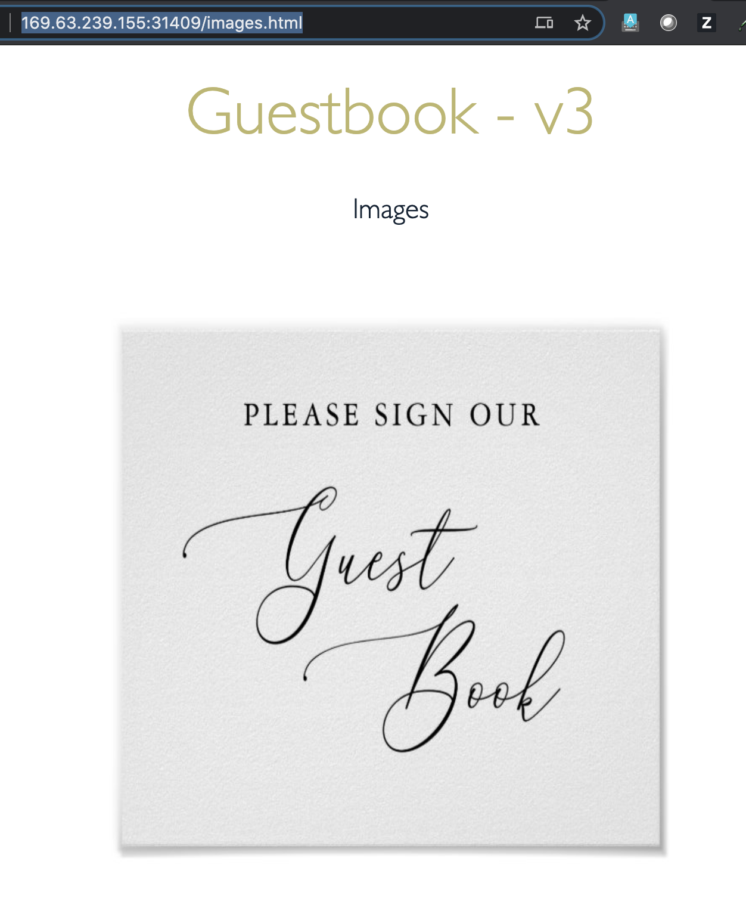

# Lab 2 File storage with kubernetes

The application is the [Guestbook App](https://github.com/IBM/guestbook), which is a sample multi-tier web application.

## Review the storage classes for file storage

```bash
kubectl get storageclasses | grep file
```

Expected output:
```
$ kubectl get storageclasses | grep file

default                    ibm.io/ibmc-file   Delete          Immediate           false                  27m
ibmc-file-bronze           ibm.io/ibmc-file   Delete          Immediate           false                  27m
ibmc-file-bronze-gid       ibm.io/ibmc-file   Delete          Immediate           false                  27m
ibmc-file-custom           ibm.io/ibmc-file   Delete          Immediate           false                  27m
ibmc-file-gold (default)   ibm.io/ibmc-file   Delete          Immediate           false                  27m
ibmc-file-gold-gid         ibm.io/ibmc-file   Delete          Immediate           false                  27m
ibmc-file-retain-bronze    ibm.io/ibmc-file   Retain          Immediate           false                  27m
ibmc-file-retain-custom    ibm.io/ibmc-file   Retain          Immediate           false                  27m
ibmc-file-retain-gold      ibm.io/ibmc-file   Retain          Immediate           false                  27m
ibmc-file-retain-silver    ibm.io/ibmc-file   Retain          Immediate           false                  27m
ibmc-file-silver           ibm.io/ibmc-file   Delete          Immediate           false                  27m
ibmc-file-silver-gid       ibm.io/ibmc-file   Delete          Immediate           false                  27m
```

This lab uses the storage class `ibm-file-silver`. Note that the default class is `ibmc-file-gold`

```
$ kubectl describe storageclass ibmc-file-silver

Name:            ibmc-file-silver
IsDefaultClass:  No
Annotations:     kubectl.kubernetes.io/last-applied-configuration={"apiVersion":"storage.k8s.io/v1","kind":"StorageClass","metadata":{"annotations":{},"labels":{"kubernetes.io/cluster-service":"true"},"name":"ibmc-file-silver"},"parameters":{"billingType":"hourly","classVersion":"2","iopsPerGB":"4","sizeRange":"[20-12000]Gi","type":"Endurance"},"provisioner":"ibm.io/ibmc-file","reclaimPolicy":"Delete"}

Provisioner:           ibm.io/ibmc-file
Parameters:            billingType=hourly,classVersion=2,iopsPerGB=4,sizeRange=[20-12000]Gi,type=Endurance
AllowVolumeExpansion:  <unset>
MountOptions:          <none>
ReclaimPolicy:         Delete
VolumeBindingMode:     Immediate
Events:                <none>
```

View the existing `PersistentVolumeClaims`

```
$ kubectl get pvc --all-namespaces
No resources found
```

## Claim Volume

Guestbook [PVC yaml]()

```
apiVersion: v1
kind: PersistentVolumeClaim
metadata:
 name: guestbook-pvc
 labels:
   billingType: hourly
   region: us-south
   zone: dal10
spec:
 accessModes:
   - ReadWriteMany
 resources:
   requests:
     storage: 20Gi
 storageClassName: ibmc-file-silver
```

Create the PVC
```bash
kubectl apply -f guestbook-pvc.yaml
```
Expected output:
```
$ kubectl create -f guestbook-pvc.yaml
persistentvolumeclaim/guestbook-pvc created
```

Verify the PVC claim is created with the status `Bound`.
```bash
kubectl get pvc
```
Expected output:

```
$ kubectl get pvc
NAME            STATUS   VOLUME                                     CAPACITY   ACCESS MODES   STORAGECLASS       AGE
guestbook-pvc   Bound    pvc-6362f614-258e-48ee-a596-62bb4629cd75   20Gi       RWX            ibmc-file-silver   26m
```

Details associated with the `pv`
```bash
kubectl get pv pvc-6362f614-258e-48ee-a596-62bb4629cd75
```
Expected output:
```
$ kubectl get pv pvc-6362f614-258e-48ee-a596-62bb4629cd75
NAME                                       CAPACITY   ACCESS MODES   RECLAIM POLICY   STATUS   CLAIM                   STORAGECLASS       REASON   AGE
pvc-6362f614-258e-48ee-a596-62bb4629cd75   20Gi       RWX            Delete           Bound    default/guestbook-pvc   ibmc-file-silver            27m
```

## Use PV in an application

Misc: (building v3 image)
```
docker build rojanjose/guestbook:v3 .
docker push rojanjose/guestbook:v3
https://hub.docker.com/repository/docker/rojanjose/guestbook/tags?page=1
```

Changes in the deployment file:
```
...
  spec:
      containers:
        - name: guestbook
          image: rojanjose/guestbook:v3
          ports:
          - name: http-server
            containerPort: 3000
          volumeMounts:
          - name: guestbook-volume
            mountPath: /app/public/images
      volumes:
      - name: guestbook-volume
        persistentVolumeClaim:
          claimName: guestbook-pvc
```

Create the Guestbook app:
```bash
cd guestbook/v3
kubectl create -f guestbook-deployment.yaml
kubectl create -f guestbook-service.yaml
```
Verify the app is runing:
```
$ kubectl get all
NAME                                READY   STATUS    RESTARTS   AGE
pod/guestbook-v1-7fc4684cdb-t8l6w   1/1     Running   0          20s

NAME                 TYPE           CLUSTER-IP      EXTERNAL-IP      PORT(S)          AGE
service/guestbook    LoadBalancer   172.21.221.36   150.238.30.150   3000:31409/TCP   4s
service/kubernetes   ClusterIP      172.21.0.1      <none>           443/TCP          3h35m

NAME                           READY   UP-TO-DATE   AVAILABLE   AGE
deployment.apps/guestbook-v1   1/1     1            1           20s

NAME                                      DESIRED   CURRENT   READY   AGE
replicaset.apps/guestbook-v1-7fc4684cdb   1         1         1       20s
```

Get the node external IP:
```
 kubectl get nodes -o wide
NAME            STATUS   ROLES    AGE     VERSION       INTERNAL-IP     EXTERNAL-IP      OS-IMAGE             KERNEL-VERSION       CONTAINER-RUNTIME
10.38.216.224   Ready    <none>   3h25m   v1.19.3+IKS   10.38.216.224   169.63.239.155   Ubuntu 18.04.5 LTS   4.15.0-122-generic   containerd://1.4.1
10.38.216.250   Ready    <none>   3h25m   v1.19.3+IKS   10.38.216.250   169.63.239.157   Ubuntu 18.04.5 LTS   4.15.0-122-generic   containerd://1.4.1
```

Run the Guestbook V3 app:
```
http://169.63.239.155:31409
```

View the changes in the guestbook application with v3 version.

Get the pod name:
```
$ kubectl get pods
NAME                            READY   STATUS    RESTARTS   AGE
guestbook-v1-7fc4684cdb-t8l6w   1/1     Running   0          103m
```
Log into the container:

```bash
kubectl exec -it guestbook-v1-7fc4684cdb-t8l6w --  busybox sh
```

Run the commands `ls -al; ls -al images; df -ah` to view the volume and files. Review the mount for the new volume. Note that images folder is empty. 

```
$ kubectl exec -it guestbook-v1-7fc4684cdb-t8l6w --  busybox sh


BusyBox v1.21.1 (Ubuntu 1:1.21.0-1ubuntu1) built-in shell (ash)
Enter 'help' for a list of built-in commands.

/app # ls -alt public
total 116
drwxr-xr-x    1 root     root          4096 Nov  3 22:52 .
drwxr-xr-x    1 root     root          4096 Nov  3 22:52 ..
-rw-r--r--    1 root     root          1061 Nov  3 22:30 index.html
drwxr-xr-x    2 65534    42949672      4096 Nov  3 22:18 images
-rw-r--r--    1 root     root           835 Nov  3 20:01 images.html
-rw-r--r--    1 root     root         84245 Nov  3 20:01 jquery.min.js
-rw-r--r--    1 root     root          1160 Nov  3 20:01 script.js
-rw-r--r--    1 root     root           833 Nov  3 20:01 style.css
/app # ls -alt public/images
total 8
drwxr-xr-x    1 root     root          4096 Nov  3 22:52 ..
drwxr-xr-x    2 65534    42949672      4096 Nov  3 22:18 .
/app #
/app # df -ah
Filesystem                Size      Used Available Use% Mounted on
overlay                  97.9G      1.4G     91.5G   1% /
proc                         0         0         0   0% /proc
tmpfs                    64.0M         0     64.0M   0% /dev
devpts                       0         0         0   0% /dev/pts
...
/dev/mapper/docker_data
                         97.9G      1.4G     91.5G   1% /etc/resolv.conf
fsf-dal1003c-fz.adn.networklayer.com:/IBM02SEV2058850_2166/data01
                         20.0G         0     20.0G   0% /app/public/images
tmpfs                     7.8G     16.0K      7.8G   0% /var/run/secrets/kubernetes.io/serviceaccount
proc                         0         0         0   0% /proc/bus
proc                         0         0         0   0% /proc/fs
proc                         0         0         0   0% /proc/irq
...
```

Verify this by viewing the data from the Guestbook application. Click on the `images` link at the bottom of the guestbook home page. The images.html page shows images with broken links.


## Copy data

Run the `kubectl cp` command to move the images into the mounted volume.
```bash
cd ../data
kubectl cp images guestbook-v1-7fc4684cdb-t8l6w:/app/public/
```

Refresh the page to view the images from the guestbook application.



## Pod crash


## Backing up data
